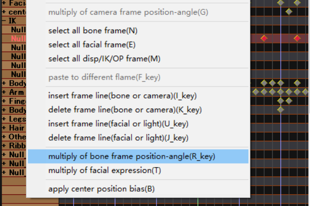
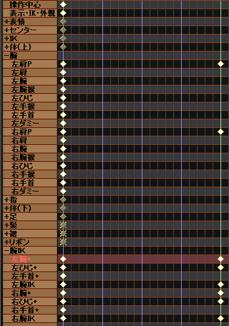
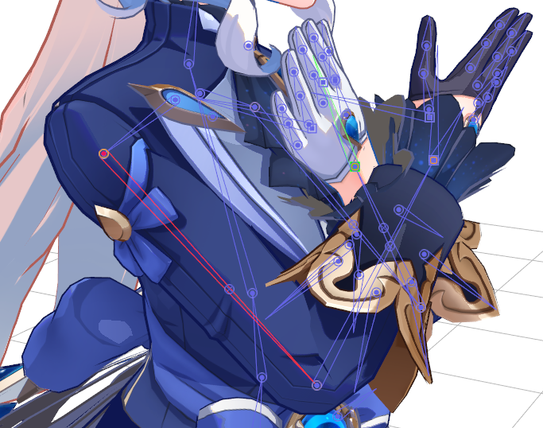

# 动作相关

## 整体修改

原神模型的一个常有问题是两个脚位置比标准要靠近一段距离，利用这个功能可整体修改。测试用vmdsizing反而做不到这一点。

## MMD摄像机

dis这个是用滚轮控制改变，但摄像机所对的中心位置不改变，即旋转时围绕的中心轴不变。但如果改变z轴距离，中心轴也会改变。

## 走路动作制作

先一个循环周期进行制作，认为在跑步机上，左脚有一个最前和最后的位置，设其距离为d。注意：把脚的IK移动方向的轴例如是z轴变化曲线设为线性。在实际路面使用时，为了保证和路面接触时成相对静止，全亲骨按z轴线性移动，并且其移动速度为单位周期2d。

## 添加腕IK，另一种制作手部动作的方法

IKMakerX.dll插件下载网址：https://paperguitar.com/mmd-related-items/134-ik-makerx.html 下载后放到PMDEditor 的 plugin 中。打开 PMDEditor 直接在默认参数下添加，参数细节暂未研究。
- 默认情况下x轴朝向肩膀方向，在空间里是斜上方，不方便移动。可能有方式改变成其他朝向。

基本思想：原来的做法是，从肩膀处开始往下逐步固定，这导致手的位置在最后才确定。现在的做法是，先确定手的位置，调整关节扭动符合人体。

使用方法：先把手移动到目标位置。通过调整图中 [腕IK] 里的骨骼：肩P，腕+，肘（ひじ），也就是肩膀开始往下的三个关节。只调整x轴旋转即可。不要动图中 [腕] 里的其他骨骼。

注意新添加的 [腕IK] 中的骨骼和原来的 [腕] 位置重合，所以要小心。

