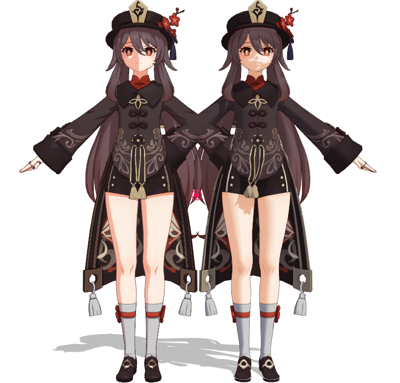
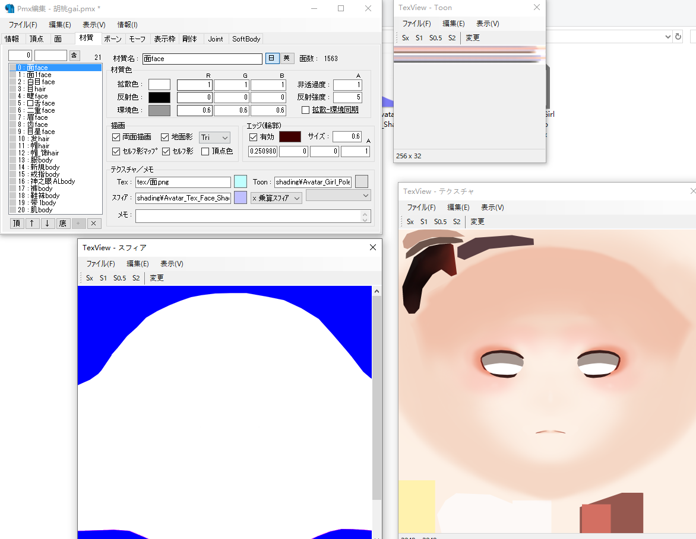
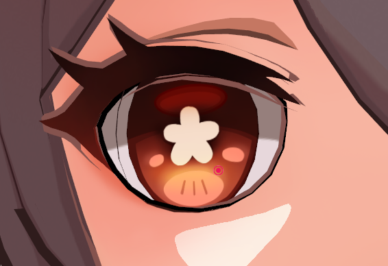
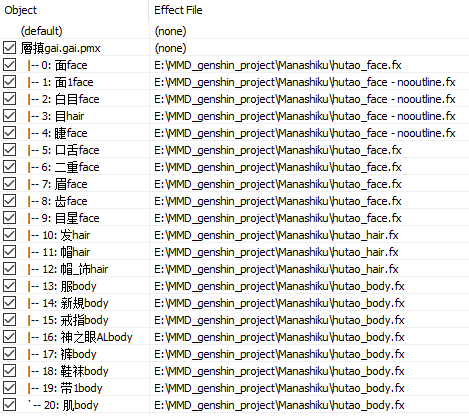

# 原神模型渲染

## Manashilku

记录一下此次使用过程，参考：https://www.youtube.com/watch?v=fl8m6V9Z2Pw，中间有些细节被省略，自己尝试时遇到些问题。

目录结构：
```
├── MMD_genshin_project
│ ├── Manashiku
│ │ ├── fulina - body.fx
│ │ ├── fulina - face.fx
│ │ ├── fulina - dress.fx
│ │ ├── fulina - hair.fx
│ │ ├── sub
│ │ │ ├── tex
│ │ │ │ ├── Avatar_Loli_Tex_FaceLightmap.png
│ │ │ │ ├── Avatar_Boy_Tex_FaceLightmap.png
│ │ │ │ ├── Avatar_Girl_Tex_FaceLightmap.png
│ │ │ │ ├── ...
│ ├── PmxEditor_0273
│ │ ├── _plugin
│ │ │ ├── genshin_tool
│ │ │ │ ├── MMDGenshin_Material_Gen_v1.1.6.dll
│ │ │ │ ├── MMDGenshin_Helper_V2.dll
│ ├── 芙宁娜
│ │ ├── shading
│ │ │ ├── Materials
│ │ │ │ ├── Avatar_Girl_Sword_Funingna_Mat_Body.json
│ │ │ │ ├── Avatar_Girl_Sword_Funingna_Mat_Dress.json
│ │ │ │ ├── Avatar_Girl_Sword_Funingna_Mat_Face.json
│ │ │ │ ├── Avatar_Girl_Sword_Funingna_Mat_Hair.json
│ │ │ ├── Avatar_Girl_Sword_Funingna_Tex_Body_Lightmap.png
│ │ │ ├── Avatar_Girl_Sword_Funingna_Tex_EffectHair_Lightmap.png
│ │ │ ├── Avatar_Girl_Sword_Funingna_Tex_Hair_Lightmap.png
│ │ │ ├── Avatar_Girl_Sword_Funingna_Tex_Hair_Shadow_Ramp.png
│ │ │ ├── Avatar_Girl_Sword_Funingna_Tex_Body_Shadow_Ramp.png
│ │ │ ├── ...
│ │ ├── 芙宁娜.pmx
│ │ ├── 芙宁娜gai.pmx
│ │ ├── 芙宁娜gaigai.pmx
```
步骤：
- https://docs.google.com/spreadsheets/d/1lrE5EGtuDsrwRJNSHIEN9hsGggxzLHmDV5rwuHkmndQ/edit#gid=0 下载官方模型furina。https://github.com/Manashiku/MMDGenshintex 下载放在Manashiku 中。角色的shading文件下载：https://github.com/zeroruka/GI-Assets/tree/main/Models/Characters 按如上结构整理文件夹。

前后效果：



工作界面：



流程：

- 在 PmxEditor 中打开`芙宁娜.pmx`，在素材中，看每个部分使用的 tex ，在 shading 中找对应的 `Lightmap.png` 和 `Shadow_Ramp.png`，填到sph和toon中。这个部分存在一些细节。视频里没有讲。对使用相同tex的部分命名为`xxx_face`，`xxx_body`，`xxx_hair`等，是为了之后操作批量快速。修改一个后，选择所有同一类型的xxx_body，在sph或者toon的路径中复制然后粘贴，就能一起修改。保存为 `芙宁娜gai.pmx`
  - 注意，_face只是标记使用了[面.png]()的素材，而不是说这个素材属于脸部。因为有时候头发和身体部分混在一起，共同使用同一个[发.png]()，那么尽管那个部分属于身体，依旧写为`xxx_hair`。
  - tex为脸部：sph使用带有蓝色的那个图（为了创造阴影？），并使用[乘算]()。toon如果没有对应face的，则使用 `xxx_Tex_Body_Shadow_Ramp.png` 或者 `xxx_Hair_Shadow_Ramp.png`，具体哪一个，看看效果？
    - [加算]()：通常用于创建发光效果或增强亮度。一个基础颜色纹理和一个光照纹理，将它们加算可以让光照效果更加明显。
    - [乘算]()：广泛用于阴影和阴影效果的创建。一个阴影纹理与基础颜色纹理相乘，可以使得暗部区域更加明显。
    - [subtex]()：通常用于创造消耗或蚀刻效果。用subtex模式来减少某些区域的颜色，使其看起来像是被阴影或其他效果覆盖。
  - tex为发：sph使用 `xxx_Tex_Hair_Lightmap.png`，subTex，toon选择对应名称即可。
  - tex为体：sph使用 `xxx_Tex_Body_Lightmap.png`，subTex，toon选择对应名称即可。
  - 找一些特殊纹理或者要发光的材质，如神之眼AL，我使用了对应的`xxx_Diffuse.png`，使用[加算]()是否是为了这个部分用的可以在png的预览图中观察出来。但脸部的diffuse这么用就出问题，我还不太清楚这里的原理。
  - 对于这个[芙宁娜]()模型，似乎编号20(腿)的sph虽然选择的是`Tex_Body_Lightmap.png`，但 toon 选择 `Hair_Shadow_Ramp.png`而不是 `Body_Shadow_Ramp.png`，否则效果上阴影颜色不对。这可能是这款模型的特殊问题。胡桃模型就是正常的选择对应名称的就好。
  - 具体细节待补充。
  - PmxEditor 中，编辑-plugin，运行 `MMDGenshin_Helper_V2.dll`，全勾选，依次点击能点击的按钮，关闭。另存为 `芙宁娜gaigai.pmx`。

- 运行 `MMDGenshin_Material_Gen_v1.1.6.dll`，点击go，选择 `Avatar_Girl_Sword_Funingna_Mat_Body.json`，会选择保存地点，保存到 `fulina - body.fx`。其他对应同理。做完后关闭。这一步似乎是独立于前面的东西，所以如果后续修改模型，这一步不需要重复做。

- 渲染：导入模型后，对应的材质选择对应的fx即可。保存同名的emm文件，下次打开后会自动加载。
- 修改fx文件：最常见的修改是outline不合适，我把脸部改为0.3，其他改为0.5。并且眼睛部分会出现以下重影问题，这可以对比原模型看。单独保存一个 `fulina - eyes_nooutline.fx`，改为0即可。

  
  

- `fulina - body.fx`会调用 sub/tex 中的内容，可能报错缺少素材。目前github上 https://github.com/Manashiku/MMDGenshintex 的 sub/tex 中并没有内容，一些教程里的文件会带有这些。我还没搞懂这些素材哪里来的。